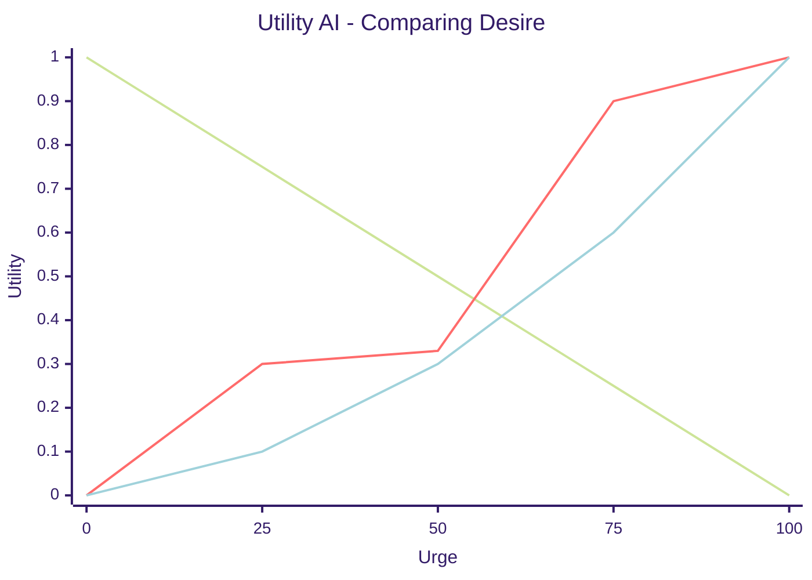
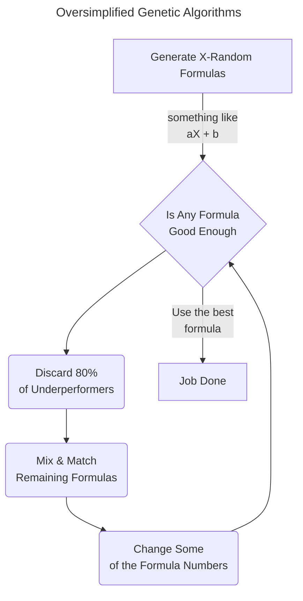

---
tags:
  - intro-to-ai
draft: true
date: 2024-10-14
---
I feel **A**rtificial **I**ntelligence has become a somewhat diluted term, especially since tools like ChatGPT became popular. As startups try to capitalise on the hype and AI becomes part of our lives, it’s more important than ever to understand what AI truly is and **how AI works**.

> [!Tip] Hot Take
> I'm going to call AI any piece of code that behaves intelligently, even if it's simple. For example, if there's an "if" statement with a number you got through trial and error, I'll consider that a basic form of AI.
# What is AI

At its core, AI is made up of one or more mathematical formulas combined together. These formulas help AI make decisions, often with the help of some extra code to guide the process. Think of it like cooking: there are different recipes to make the same dish, and each recipe is like a different type of AI.
## Rules-based AI

Take the game **The Sims** for example, where developers used a system called [Utility AI](https://en.wikipedia.org/wiki/Utility_system). This system decides how the game's characters interact with their surroundings, like when to eat or sleep.

An if I were to oversimplify it, an AI may think something like this:

```python
if HUNGER * 0.5 + HAPPYNESS * 0.2 < SLEEP * 0.4:
	go_eat()
else:
	go_sleep()
```

In this case, the AI is checking whether a character is hungrier than they are sleepy or happy. If they're hungrier, the character will eat; if not, they'll go to sleep. While the above code uses numbers to keep things simple, in reality, developers often use more complex mathematical functions to represent these decisions.

If you'd like to learn more, here's [a great video](https://www.youtube.com/watch?v=9gf2MT-IOsg) from GMTK that explains how Utility AI works.



>[!Question] What Does This Chart Show?
><font style="color:blue">■ **Sleep**</font>  - The more tired a character gets, the more likely they are to sleep.
>
><font style="color:green">■ **Eat**</font>  - When the urge to eat increases, the character is more likely to find food.
>
><font style="color:red">■ **Energy**</font>  - As energy levels drop, the character will be motivated to rest.

This type of AI is created by experts who carefully design these rules to make characters behave in realistic ways.

## Genetic Algorithms

Do you like SPORE and want to commit AI genocide in order to finish your task? Well you're in luck 'cause **genetic algorithms** may be the thing your heart desires. 

The oversimplified explanation is that:
1. start with a bunch of random math formulas 
2. check if any formula is solves your task
3. discard the bottom 80% of the formulas that are underperforming
4. take bits and pieces from the surviving formulas and make new ones
5. if want to spice things us you can even change a few numbers in the formulas (this is called mutating)
6. repeat steps 2 -> 5 until you find a formula that works or get bored



This process is similar to evolution, where only the fittest survive and combine to form new generations. Over time, the AI improves and gets closer to solving the task at hand.
## Machine Learning

**M**achine **L**earning is another popular type of AI, but it's a bit more advanced. Instead of creating specific rules or formulas, ML allows the AI to learn patterns from data on its own.