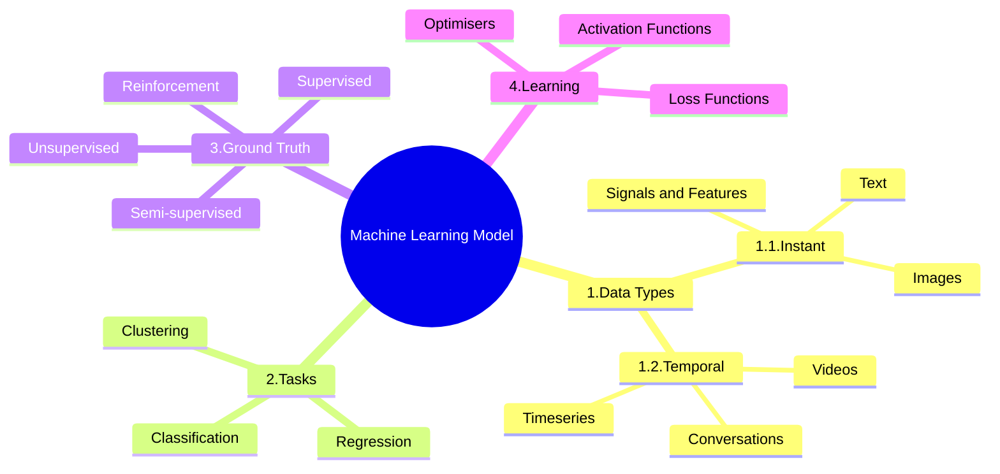

```mermaid
mindmap
	root((Machine Learning Model))
		1.Data Types 
			1.1.Instant
				Signals and Features
				Images
				Text
			1.2.Temporal
				Timeseries
				Videos
				Conversations
		2.Tasks
			Classification
			Regression
			Clustering
		3.Ground Truth
			Supervised
			Unsupervised
			Semi-supervised
			Reinforcement
		4.Learning
			Activation Functions
			Loss Functions
			Optimisers
```

