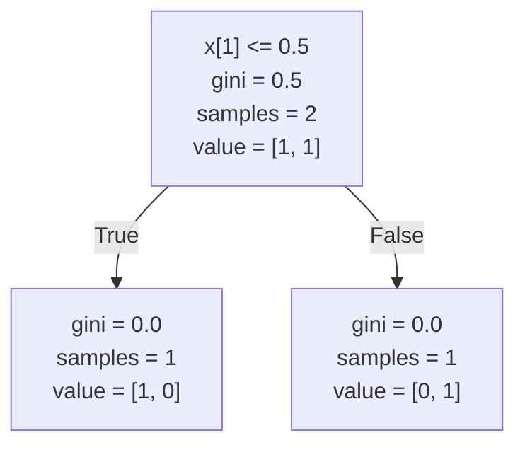

# What is it

Decision trees are like IF-ELSE statements, but instead of having you manually pick the cutoffs or operations between inputs. 

You just have to gather a bunch of examples of given **this** do **that** and they'll automagically figure out the rest based on those examples.

## Training using scikit-learn

First, you'll need some examples to train (grow?) the tree. Let's say, each time your inputs are **0** the output should also be **0**. Same thing for inputs **1** and outputs **1**.

```python
>> inputs = [[0, 0], [1, 1]]
>> outputs = [0, 1]
```

Then we'll need to instantiate a object of the **tree** class from scikit

```python
>> from sklearn import tree
>> ai = tree.DecisionTreeClassifier()
```

Then we can train the tree using our previously declared data

```python
>> ai = ai.fit(inputs, outputs)
```

And finally we make a prediction on some unseen data to see what happens

```python
>> ai.predict([[2., 2.]])
array([1])
```

Here's how the entire code combined looks like

```python
from sklearn import tree

if __name__ == "__main__":
	# declare date
	inputs = [[0.0, 0.0], [1.0, 1.0]]
	outputs = [0.0, 1.0]
	
	# instantiate tree object
	ai = tree.DecisionTreeClassifier()
	
	# train tree object
	ai = ai.fit(inputs, outputs)
	
	# make some predictions
	ai.predict([[2.0, 2.0]])
```

The resulting decision tree would look something like this



You can read checkout more examples by accessing the [scikit-learn docs](https://scikit-learn.org/1.5/modules/tree.html) (from where I shamelessly copied the example).

## How they work