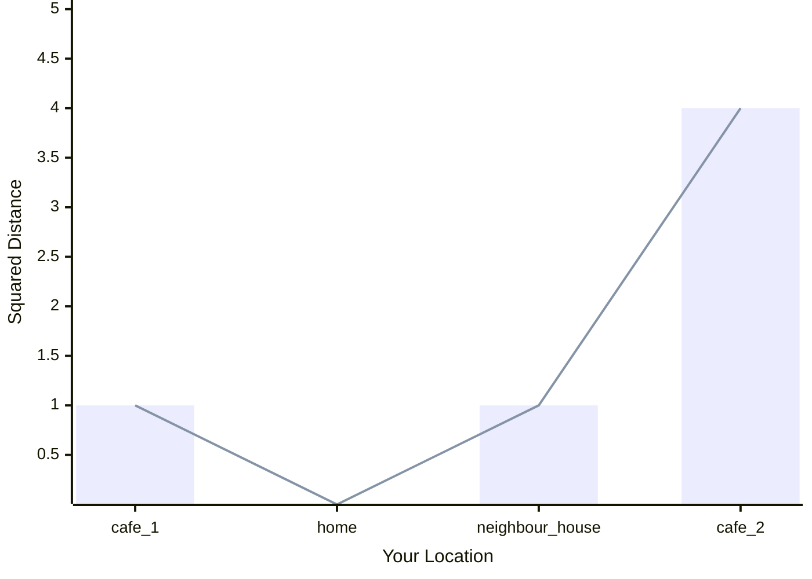
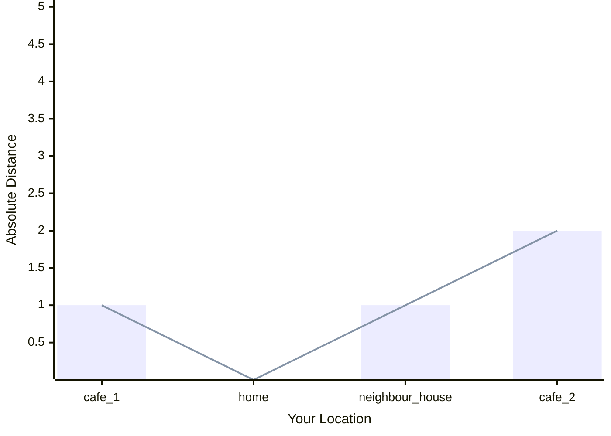

# TL;DR

<details>
	<summary>Lesson Summary</summary>
	<p>Loss Functions (also known as Error Functions) are used to calculate how far an AI behaviour is from an expected behaviour. The AI uses the result of the error function to take a step in the right direction. There are multiple error functions because each function is better for a given task the AI needs to be better at. </p> 
</details>

# Your Quest

Quests are here to provide some purpose for having to read through the theory. Read the quest and figure out how the information below can help you complete it.

> [!warning] The Quest for the Wakewine
>Read the post to figure out what Error Functions are to find your way to the nearest _café_.
> 
> - Understand Mean Squared Error
> - Understand Mean Absolute Error 
> 
> <big>**Description**</big>
> 
> **The Day of Conquest has arrived!** The long-awaited moment to master the arcane arts of machine learning is upon you. Yet, one important matter must be addressed.
>
>With unwavering determination, you rush towards the kitchen. However, the sight that greets you is beyond belief. “Unacceptable!” you shout. “One does not simply acquire knowledge cafeineless!”
>
>You take a deep breath to steady yourself. "Luckily, there are two coffee shops nearby", you say to yourself. But now, you must decide: **Which one will you choose?**
> 
> <big>**Rewards**</big>
> 
> You will receive: 
> 
> - 📜 **The Scroll of Loss Functions**

# What are Loss Functions

Let's say a friend of ours, Roger, asks us whether we want to go to a coffee shop we've never been before. However, Roger's a bit of a douche and only answers with "hot" if we're closer or "cold" if we're further from the shop.

Thus, without knowing how far exactly we are, we start walking while asking Roger how close we are every step of the way. The moment he'll scream "boiling hot", we know we got to the destination. Thus concluding our journey from point **A** to **B** for our coffee.

A similar thing happens with Machine Learning. The only difference is that **A** represents how the AI behaves right now and **B** is how we want it to behave. And we quantify the difference between how it behaves and how it should behave with a **Loss Function** (also known as **Error Functions**).
# How to Calculate Squared Distance

When someone asks you how far the shop is relative to your current position, you won't tell them it's **-2 meters away**, just because you're facing the opposed direction. And that's exactly the reason why when we subtract X (the target position) from Xo (our current position) we raise the result to the power of 2. Just so we have a **always positive** distance (though a bit larger than in reality).
## Formula

$$ 
distance = (X_O - X)^2
$$
## Visualisation


## Python Code

```python
Xo = 0 # your starting position
X  = 2 # the place you want to get to

distance_squared = (Xo - X) ** 2
```

# Absolute Distance

Previously, when discussing squared distance, we said that we need to square the difference such that the resulting number is always positive. However, a side effect is that now we're claiming we are **4 meters** away from our destination, when in fact we're just **2 meters** away. 

One way to negate this effect, is to calculate the **square root** of the result.

## Formula

$$ 
distance = \sqrt{(X_O - X)^2}
$$
## Visualisation


## Python Code

```python
Xo = 0 # your starting position
X  = 2 # the place you want to get to

distance_absolute = ((Xo - X) ** 2) ** 0.5
# OR
distance_absolute = abs(Xo - X)
```

# When to use the Mean

Let's go back to our example with the coffee shop. Roger tells us with each step we take whether we are closer our further from our destination with each step we take. Which means that there are two ways in which we can **learn** what's the right path:
1. we adjust our trajectory based on each individual feedback we receive
2. or we take a few steps in a direction and then do a average (mean) over the entire feedback 

By going with the second approach, we are more likely to get the general direction and less likely to move **[like this](https://www.tiktok.com/@igreenscreenthings/video/7398558205430877482?is_from_webapp=1&sender_device=pc)**.