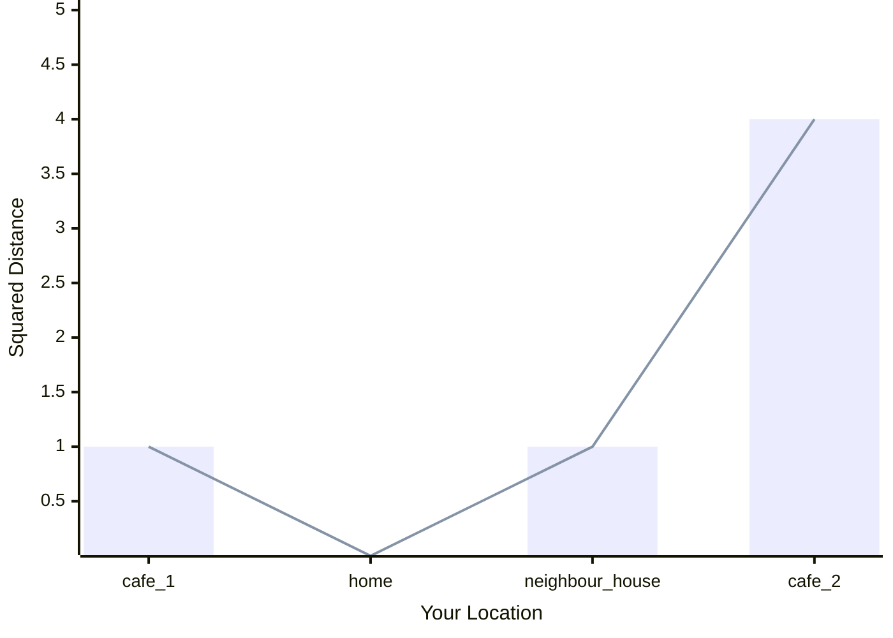
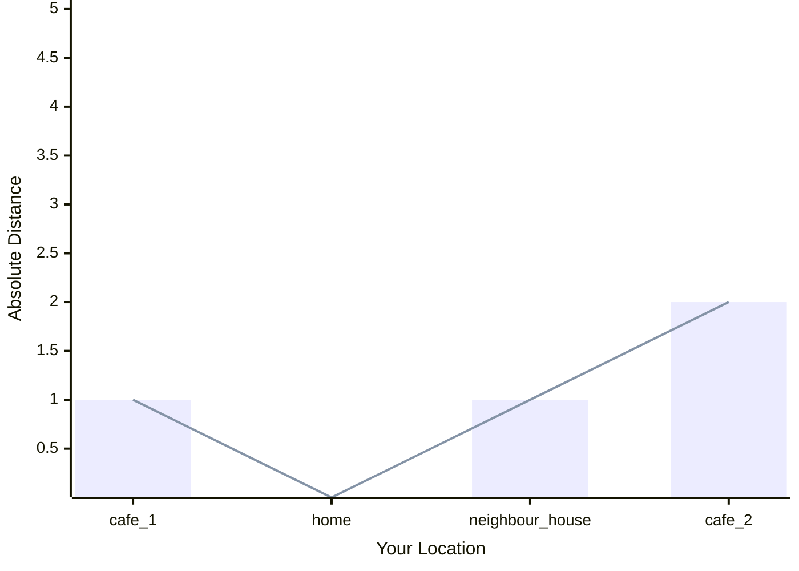

# TL;DR

<details>
	<summary>Lesson Summary</summary>
	<p>Loss Functions (also known as Error Functions) are used to measure how different the AI's predictions are from the expected result. The AI then uses this difference to improve its performance. There are multiple error functions because each function is better for a given task the AI needs to be better at. </p> 
</details>

# Your Quest

Quests are here to provide some purpose for having to read through the theory. Read the quest and figure out how the information below can help you complete it.

> [!warning] The Quest for the Wakewine
>Read the post to figure out what Error Functions are to find your way to the nearest _café_.
> 
> - Understand Mean Squared Error
> - Understand Mean Absolute Error 
> 
> <big>**Description**</big>
> 
> **The Day of Conquest has arrived!** The long-awaited moment to master the arcane arts of machine learning is upon you. Yet, one important matter must be addressed.
>
>With unwavering determination, you rush towards the kitchen. However, the sight that greets you is beyond belief. “Unacceptable!” you shout. “One does not simply acquire knowledge cafeineless!”
>
>You take a deep breath to steady yourself. "Luckily, there are two coffee shops nearby", you say to yourself. But now, you must decide: **Which one will you choose?**
> 
> <big>**Rewards**</big>
> 
> You will receive: 
> 
> - 📜 **The Scroll of Loss Functions**

# What are Loss Functions

Let’s simplify things by imagining this scenario: Your friend Roger wants to take you to a coffee shop you’ve never been to before. However, Roger doesn’t give you the exact distance, just clues like "hot" if you're getting closer and "cold" if you're moving further away.

You start walking and, step by step, ask Roger how close you are. Eventually, when Roger says "boiling hot," you know you’ve reached the café.

In machine learning, a similar process happens. The AI is trying to learn, and **A** represents the AI's current behaviour (how it predicts something), while **B** is the behaviour you want it to have (the correct prediction). A **Loss Function** measures how far the AI's behaviour is from where it should be, helping it improve over time.
# How to Calculate Squared Distance

In the coffee shop example, let’s say you’re standing at point **Xo** (your current position), and you want to know how far you are from point **X** (the coffee shop). You wouldn’t say the distance is **-2 meters**, right? Even if you’re facing the wrong way, distance is always positive.

To make sure the distance is always positive, we square the difference between your position (**Xo**) and the coffee shop (**X**).
## Formula

$$ 
distance = (X_O - X)^2
$$
This formula simply means: take the difference between where you are and where you want to be, and square it to get rid of any negative values.
## Visualisation


## Python Code

Here, the code calculates how far you are from the coffee shop, even if you’re going in the wrong direction.

```python
Xo = 0 # your starting position
X  = 2 # the place you want to get to

distance_squared = (Xo - X) ** 2
```

# Absolute Distance

Previously, when discussing squared distance, we said that we need to square the difference such that the resulting number is always positive. However, a side effect is that now we're claiming we are **4 meters** away from our destination, when in fact we're just **2 meters** away. 

A simpler way to calculate the actual distance without making it larger is by using **absolute distance**. This just means taking the difference between two points and ignoring the negative sign.

## Formula

$$ 
distance = |X_O - X|
$$
This formula means we take the absolute value of the difference between your current position (**Xo**) and your destination (**X**), which gives us the actual distance.
## Visualisation


## Python Code

```python
Xo = 0 # your starting position
X  = 2 # the place you want to get to

distance_absolute = abs(Xo - X)
```

Here, the code calculates the real distance without exaggerating it.
# When to Use the Mean

Now imagine you ask Roger for feedback on every step you take. Each time, he says whether you're "hotter" or "colder." You could adjust your direction based on every individual piece of feedback, but this might make you [zigzag all over the place](https://www.tiktok.com/@igreenscreenthings/video/7398558205430877482?is_from_webapp=1).

Instead, you could take several steps, gather all the feedback, and **average** (or take the **mean**) of what Roger told you. This helps you get a clearer idea of the general direction to take.

In machine learning, using the mean helps smooth out noisy signals and keeps the model from reacting too wildly to small changes. 